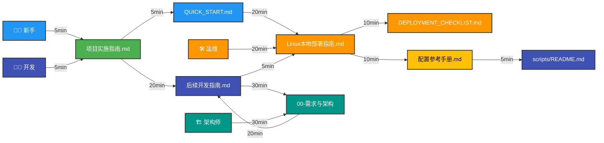
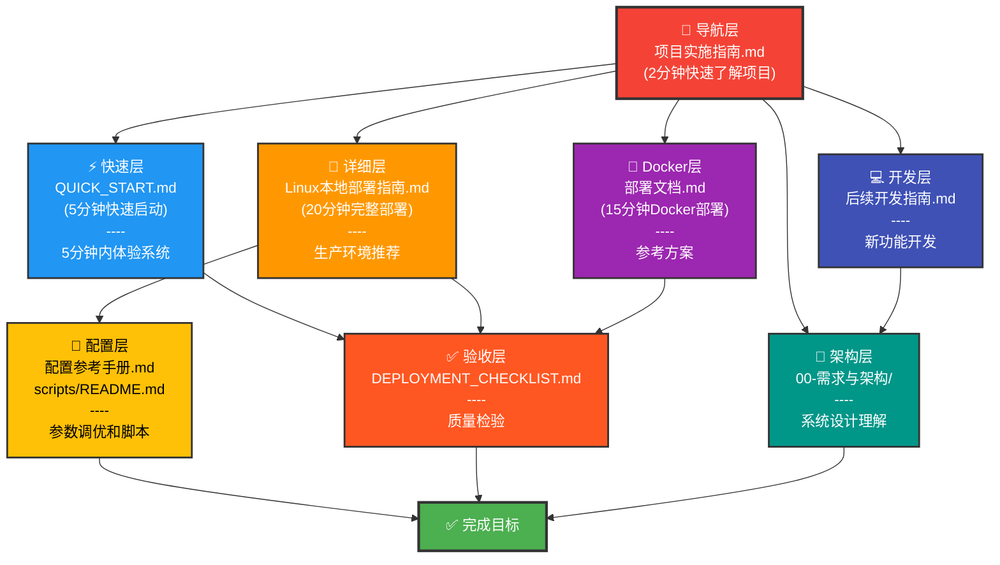
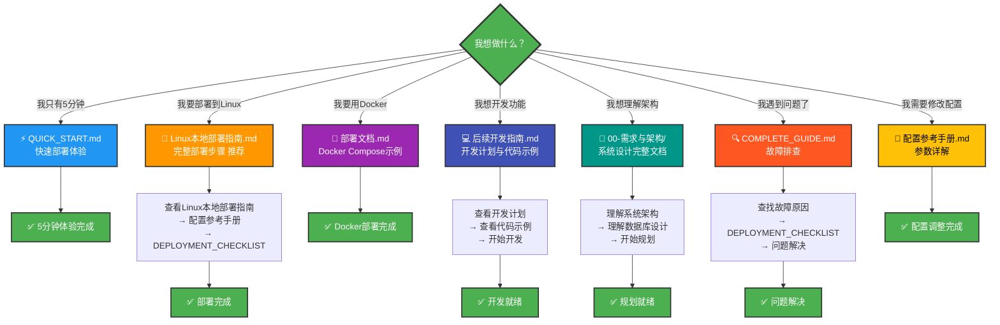
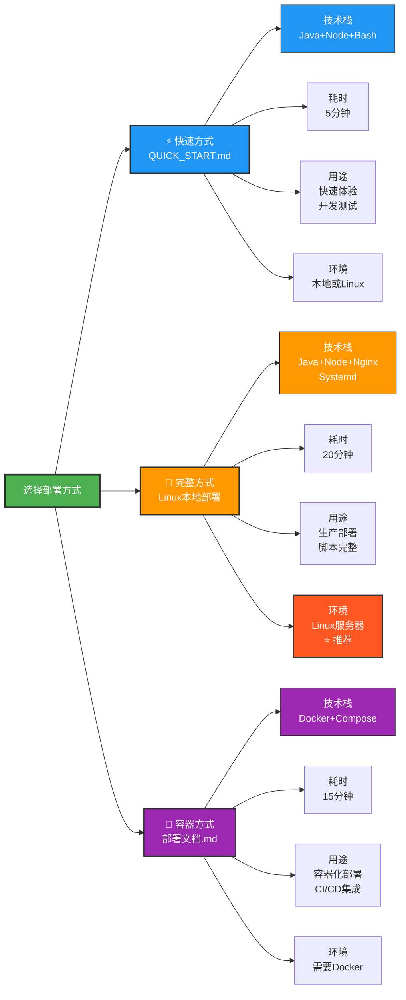

<!-- 文档导览结构 - 可视化 -->

# 📊 文档导览可视化图表

## 1. 完整导航流程图

```mermaid
graph TD
    Start([开始] <br/> 我想做什么？)
    
    Start -->|快速体验<br/>5分钟| Quick["⚡ QUICK_START.md<br/>快速部署"]
    Start -->|完整部署<br/>20分钟| Linux["📖 Linux本地部署指南<br/>完整操作步骤"]
    Start -->|Docker方案<br/>15分钟| Docker["🐳 部署文档.md<br/>Docker Compose"]
    Start -->|理解项目<br/>5分钟| Nav["📌 项目实施指南.md<br/>项目总览导航"]
    Start -->|遇到问题<br/>排查| Debugg["🔍 COMPLETE_GUIDE.md<br/>故障排查"]
    Start -->|开发功能<br/>20分钟| Dev["💻 后续开发指南.md<br/>开发指南"]
    Start -->|理解架构<br/>30分钟| Arch["📐 00-需求与架构<br/>系统设计"]
    
    Quick --> Success1["✅ 部署完成<br/>快速验证"]
    Linux --> CheckList["✅ DEPLOYMENT_CHECKLIST.md<br/>部署检查清单"]
    CheckList --> Config["🔧 配置参考手册.md<br/>配置调整"]
    Config --> Success2["✅ 部署完成<br/>生产环境"]
    Docker --> Success3["✅ Docker部署<br/>容器运行"]
    Nav --> Select{选择路径}
    Select -->|快速体验| Quick
    Select -->|完整部署| Linux
    Select -->|Docker部署| Docker
    Select -->|开发功能| Dev
    Debugg --> FindSol["查找解决方案<br/>参考相关文档"]
    FindSol --> Success4["✅ 问题解决<br/>继续部署"]
    Dev --> Arch
    Arch --> Success5["✅ 架构理解完整<br/>开始开发"]
    
    style Start fill:#4CAF50,stroke:#333,stroke-width:2px,color:#fff
    style Quick fill:#2196F3,stroke:#333,stroke-width:2px,color:#fff
    style Linux fill:#FF9800,stroke:#333,stroke-width:2px,color:#fff
    style Docker fill:#9C27B0,stroke:#333,stroke-width:2px,color:#fff
    style Nav fill:#F44336,stroke:#333,stroke-width:2px,color:#fff
    style Debugg fill:#FF5722,stroke:#333,stroke-width:2px,color:#fff
    style Dev fill:#3F51B5,stroke:#333,stroke-width:2px,color:#fff
    style Arch fill:#009688,stroke:#333,stroke-width:2px,color:#fff
    style CheckList fill:#FF9800,stroke:#333,stroke-width:2px,color:#fff
    style Config fill:#FF9800,stroke:#333,stroke-width:2px,color:#fff
    style Success1 fill:#4CAF50,stroke:#333,stroke-width:2px,color:#fff
    style Success2 fill:#4CAF50,stroke:#333,stroke-width:2px,color:#fff
    style Success3 fill:#4CAF50,stroke:#333,stroke-width:2px,color:#fff
    style Success4 fill:#4CAF50,stroke:#333,stroke-width:2px,color:#fff
    style Success5 fill:#4CAF50,stroke:#333,stroke-width:2px,color:#fff
```

---

## 2. 用户角色推荐路径



---

## 3. 文档层级关系



---

## 4. 快速路径决策树



---

## 5. 部署选项对比



---

**图表说明**:
- 🔵 蓝色: 快速方案
- 🟠 橙色: 完整方案 (推荐)
- 🟣 紫色: Docker方案
- 🟢 绿色: 成功完成

---

## 💡 何时使用哪个图表？

1. **完整导航流程图** - 第一次不知道从哪开始
2. **用户角色推荐路径** - 快速找到适合自己的文档路径
3. **文档层级关系** - 理解文档之间的结构和依赖关系
4. **快速路径决策树** - 迅速定位需要的文档
5. **部署选项对比** - 选择合适的部署方案

---

*可视化图表 - v1.0 | 更新于 2026-02-17*
